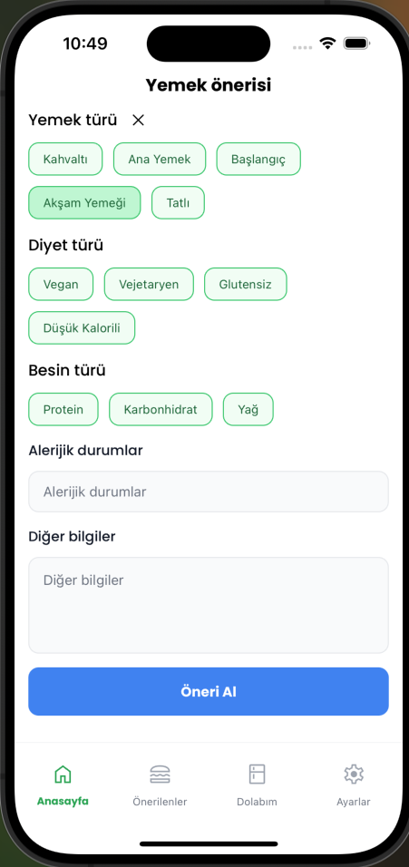
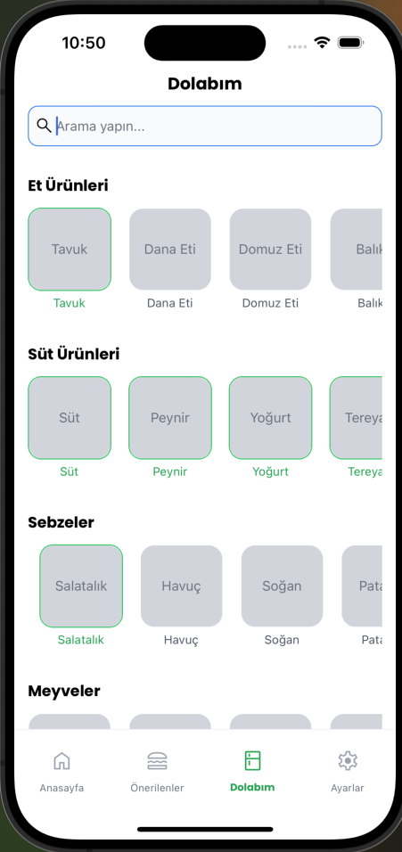
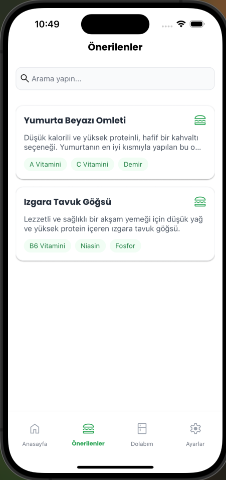
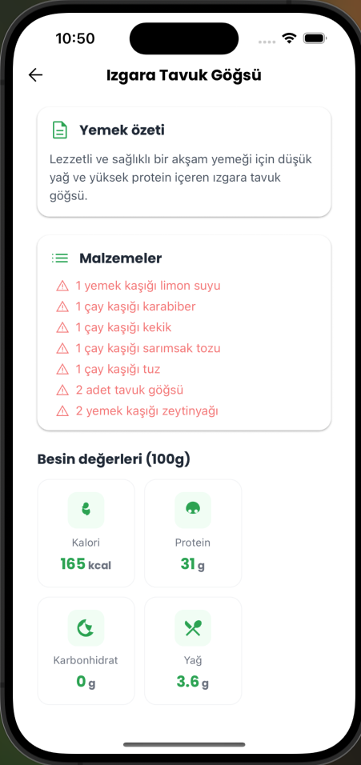
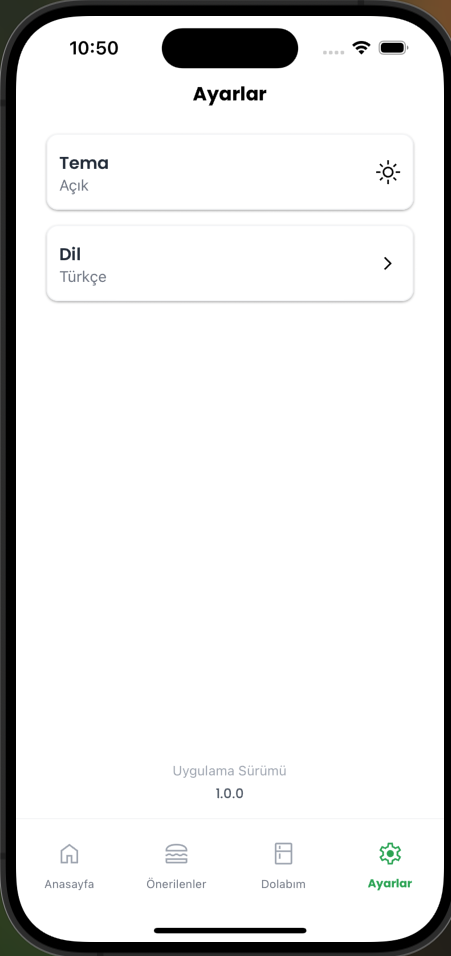

# 🍳 AI Tarifleri

AI Tarifleri, buzdolabınızdaki malzemelerden yola çıkarak yapabileceğiniz yemekleri keşfetmenizi sağlayan yapay zeka destekli bir tarif öneri uygulamasıdır. Uygulama, OpenAI API'yi kullanarak dolaplarınızdaki malzemelere göre size özel tarifler sunar, besin değerleriyle birlikte detaylı hazırlık talimatları verir ve beslenme tercihlerinize göre öneriler yapar.

## ✨ Özellikler

- 🥘 **Yapay Zeka Destekli Tarif Önerileri**: OpenAI API kullanarak buzdolabınızdaki malzemelere göre özelleştirilmiş tarifler alın
- 🍎 **Buzdolabı Yönetimi**: Evinizde bulunan malzemeleri kategorilere göre düzenleyin ve takip edin
- 🥗 **Besin Filtresi**: Protein, karbonhidrat veya yağ ağırlıklı tarifler için filtreleme yapın
- 🌱 **Diyet Tercihleri**: Vegan, vejetaryen, glutensiz veya düşük kalorili tarif önerileri alın
- 🍲 **Yemek Türü Seçimi**: Kahvaltı, ana yemek, başlangıç, akşam yemeği veya tatlı gibi kategorilerde öneriler alın
- 📊 **Beslenme Bilgisi**: Her tarif için kalori, protein, karbonhidrat, yağ ve besin değeri bilgilerini görüntüleyin
- 👨‍🍳 **Detaylı Talimatlar**: Yemeklerin hazırlık aşamaları ve servis önerileri hakkında ayrıntılı bilgi alın
- 🔔 **Alerji Bildirimi**: Alerjik durumlarınızı belirterek size uygun tariflere erişin

## 📱 Ekran Görüntüleri

<div style="display: flex; flex-direction: row; flex-wrap: wrap; justify-content: space-between;">
  
  
  
  
  
</div>

## 🛠️ Teknolojiler

- [React Native](https://reactnative.dev/)
- [Expo](https://expo.dev/)
- [NativeWind](https://www.nativewind.dev/)
- [OpenAI API](https://openai.com/api/)
- [Redux Toolkit](https://redux-toolkit.js.org/)
- [i18next](https://www.i18next.com/)
- [React Navigation / Expo Router](https://reactnavigation.org/)
- [Formik](https://formik.org/) [Yup](https://github.com/jquense/yup)
- [React Native MMKV](https://github.com/mrousavy/react-native-mmkv)

## 🚀 Kurulum

### Gereksinimler

- [Node.js](https://nodejs.org/) (>= 18.x)
- [Expo CLI](https://docs.expo.dev/get-started/installation/)
- Eğer yerel iOS derlemesi yapacaksanız: Xcode ve CocoaPods
- Eğer yerel Android derlemesi yapacaksanız: Android Studio ve JDK

### Kurulum Adımları

1. Repo'yu klonlayın:
```bash
git clone https://github.com/your-username/ai-tarifleri.git
cd ai-tarifleri
```

2. Bağımlılıkları yükleyin:
```bash
npm install
```

3. `.env` dosyası oluşturun ve gerekli API anahtarlarınızı ekleyin:
```
# Projenin kök dizininde .env.example dosyasını .env olarak kopyalayıp düzenleyebilirsiniz
EXPO_PUBLIC_OPENAI_API_KEY=your_openai_api_key_here
EXPO_PUBLIC_ENCRYPTION_KEY=your_encryption_key_here
```

4. Uygulamayı başlatın:
```bash
# Expo Go ile geliştirme modunda
npm start

# iOS için (macOS gerekir)
npm run ios

# Android için
npm run android
```

## 📖 Kullanım

1. **Ana Sayfa**: Yemek türü, diyet türü ve besin türü filtrelerini kullanarak tarif önerileri alın
2. **Önerilenler**: Daha önce aldığınız tarif önerilerini görüntüleyin
3. **Dolabım**: Buzdolabınızdaki malzemeleri kategorilere göre ekleyin ve yönetin
4. **Ayarlar**: Uygulama dilini değiştirin ve diğer ayarları yönetin

## 🔑 Ortam Değişkenleri

Uygulamanın düzgün çalışması için `.env` dosyasında aşağıdaki ortam değişkenlerini yapılandırmanız gerekir (örnek için `.env.example` dosyasını inceleyebilirsiniz):